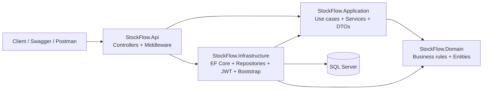
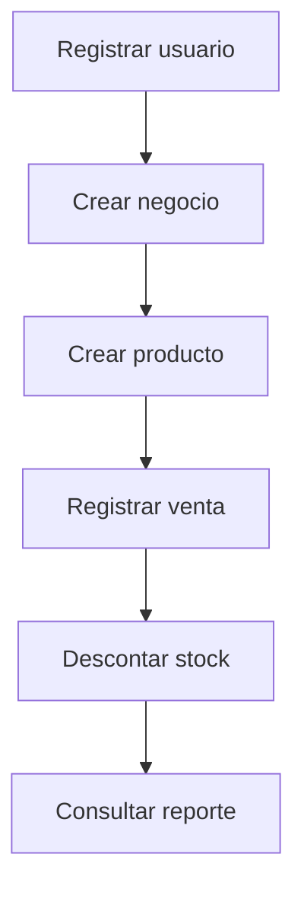

# StockFlow API — Production-style Inventory & Sales Backend

[](https://github.com/Nicolas-Aguilar/StockFlow-API/actions/workflows/ci.yml)


[](#license)
[](#testing)
[](#quality-signals)

StockFlow API es un backend profesional en ASP.NET Core para un sistema de inventario y ventas pensado para pequenos negocios.
Resuelve problemas reales de catalogo, stock, caducidad, ventas y reportes sin caer en un CRUD basico.
El proyecto prioriza reglas de negocio, aislamiento por negocio mediante `BusinessId`, seguridad con JWT y una arquitectura por capas mantenible.
Tambien sirve como pieza de portfolio para demostrar una forma seria de construir, probar y documentar una API .NET moderna.

## Why this project matters

Muchos proyectos de inventario de portfolio muestran endpoints CRUD, pero no modelan decisiones que importan en produccion: autenticacion, multi-tenant simple, validaciones de negocio, ventas transaccionales, descuento automatico de stock, reportes y una historia de pruebas.

StockFlow API apunta exactamente a ese espacio: una API backend que se puede explicar facil en una entrevista tecnica, pero que tambien muestra criterio de arquitectura y foco en un caso de negocio entendible.

## Quick capabilities

| Capability | Status | Notes |
|---|---|---|
| Auth JWT | OK | Registro, login y `GET /api/auth/me` |
| Multi-tenant por BusinessId | OK | Todo dato operativo se filtra por `BusinessId` |
| Productos | OK | Catalogo, busqueda, bajo stock, expiracion, activacion/desactivacion |
| Inventario | OK | Movimientos manuales e historial por producto |
| Ventas | OK | Venta transaccional con descuento automatico de stock |
| Reportes | OK | Bajo stock, expiracion, top sellers, ventas, ganancias e inventario |
| Pruebas unitarias | OK | Suite en `tests/StockFlow.UnitTests` |
| Pruebas de integracion | OK | Suite en `tests/StockFlow.IntegrationTests` con Docker/Testcontainers |
| CI | OK | Workflow en `.github/workflows/ci.yml` |

## Architecture at a glance



## Main business flow



## Why Docker-first

El flujo principal ya esta preparado para levantar API + SQL Server con un solo comando, incluyendo healthcheck y bootstrap al iniciar. Eso reduce friccion para reviewers, reclutadores y cualquier persona que quiera probar el proyecto desde cero sin pelear con configuraciones locales primero.

## Getting started from zero

### Prerequisites

- Docker Desktop o Docker Engine en ejecucion
- Git
- Opcional para flujo local: .NET SDK 8

### Recommended path: Docker-first

### 1. Crear archivo de entorno

```bash
cp .env.example .env
```

Configura al menos estas variables en `.env`:

- `SQLSERVER_SA_PASSWORD`: password local para SQL Server
- `JWT_KEY`: clave JWT larga para desarrollo local

Los demas valores del compose tienen defaults razonables.

### 2. Levantar el stack completo

```bash
docker compose up --build
```

Esto inicia:

- `sqlserver` con healthcheck
- `api` en `http://localhost:8080`
- bootstrap de base de datos al arrancar

### 3. Abrir endpoints utiles

- Swagger: `http://localhost:8080/swagger`
- Health: `http://localhost:8080/health`

### 4. Seed demo opcional

Si quieres probar la API con datos iniciales, cambia en `.env`:

```text
BOOTSTRAP_SEED_DEMO_DATA=true
```

Luego vuelve a levantar el stack:

```bash
docker compose up --build
```

Si el seed esta activo, se crea:

- usuario: `demo@stockflow.local`
- password: `Demo12345!`
- negocio: `StockFlow Demo Store`

### Local alternative: .NET CLI + SQL Server en Docker

Si prefieres ejecutar solo SQL Server en contenedor y correr la API en host:

```bash
docker compose up -d sqlserver
dotnet restore StockFlow.sln
dotnet build StockFlow.sln
dotnet user-secrets set "ConnectionStrings:DefaultConnection" "Server=localhost,1433;Database=StockFlowDb;User Id=sa;Password=<tu-password-local>;TrustServerCertificate=True;" --project src/StockFlow.Api
dotnet user-secrets set "Jwt:Key" "<tu-clave-jwt-local-larga-y-unica>" --project src/StockFlow.Api
dotnet run --project src/StockFlow.Api
```

En este flujo, Swagger tambien queda disponible en el entorno de desarrollo local de la API.

### Environment variables

`docker-compose.yml` usa principalmente estas variables:

- `SQLSERVER_SA_PASSWORD`
- `SQLSERVER_SQL_PORT`
- `API_HTTP_PORT`
- `JWT_KEY`
- `JWT_ISSUER`
- `JWT_AUDIENCE`
- `BOOTSTRAP_APPLY_MIGRATIONS`
- `BOOTSTRAP_SEED_DEMO_DATA`

Defaults importantes:

- `BOOTSTRAP_APPLY_MIGRATIONS=true`
- `BOOTSTRAP_SEED_DEMO_DATA=false`
- `API_HTTP_PORT=8080`

## Example API response

Ejemplo visual basado en la respuesta de autenticacion (`AuthResponse`):

```json
{
  "token": "eyJhbGciOiJIUzI1NiIsInR5cCI6IkpXVCJ9...",
  "expiresAtUtc": "2026-04-30T01:30:00Z",
  "user": {
    "id": "2d3df7bb-6d45-47f2-a99f-6aa148a8f1f1",
    "fullName": "Ana Perez",
    "email": "ana@stockflow.local",
    "isActive": true,
    "createdAt": "2026-04-29T23:00:00Z",
    "updatedAt": "2026-04-29T23:00:00Z"
  },
  "business": {
    "id": "20f5529a-36eb-4aa4-b6bf-9c573b7c57f5",
    "ownerUserId": "2d3df7bb-6d45-47f2-a99f-6aa148a8f1f1",
    "name": "Ana Market",
    "description": "Negocio demo para pruebas locales",
    "isActive": true,
    "createdAt": "2026-04-29T23:00:00Z",
    "updatedAt": "2026-04-29T23:00:00Z"
  }
}
```

## Testing

Ejecutar toda la solucion:

```bash
dotnet test StockFlow.sln
```

Ejecutar solo unit tests:

```bash
dotnet test tests/StockFlow.UnitTests/StockFlow.UnitTests.csproj
```

Ejecutar solo integration tests:

```bash
dotnet test tests/StockFlow.IntegrationTests/StockFlow.IntegrationTests.csproj
```

Notas importantes:

- Las pruebas de integracion usan Testcontainers y SQL Server real
- Docker debe estar disponible para `tests/StockFlow.IntegrationTests`
- El workflow de CI actual restaura, compila y ejecuta `dotnet test StockFlow.sln`

## Swagger screenshots

Todavia no hay capturas versionadas en el repositorio. Esta seccion queda lista para agregarlas sin reestructurar el README.

### Placeholder 1 - Auth endpoints

Agregar una captura de Swagger mostrando `POST /api/auth/register`, `POST /api/auth/login` y `GET /api/auth/me` autenticado.

Sugerencia de ruta: `docs/images/swagger/auth-overview.png`

### Placeholder 2 - Products and inventory

Agregar una captura de Swagger con `POST /api/products`, `GET /api/products/low-stock` y `POST /api/inventory/movements`.

Sugerencia de ruta: `docs/images/swagger/products-inventory.png`

### Placeholder 3 - Reports

Agregar una captura con `GET /api/reports/sales-summary`, `GET /api/reports/profit-summary` y `GET /api/reports/inventory-valuation`.

Sugerencia de ruta: `docs/images/swagger/reports.png`

## Project modules

- Auth: `register`, `login`, `me`
- Business: `GET/PUT /api/businesses/me`
- Categories: crear, listar, consultar, actualizar y desactivar
- Products: crear, listar, consultar, buscar, bajo stock, proximos a caducar, caducados, actualizar, desactivar y eliminar segun historial
- Inventory: movimientos manuales, listado e historial por producto
- Sales: creacion transaccional, consulta general, por id y por rango de fechas
- Reports: bajo stock, proximos a caducar, caducados, mas vendidos, resumen de ventas, resumen de ganancias y valoracion de inventario

## What this project demonstrates

- Arquitectura por capas aplicada a una API .NET realista
- Reglas de negocio que viven fuera de los controladores
- Seguridad base con JWT y control de acceso por negocio
- EF Core con SQL Server para persistencia y bootstrap automatizado
- Onboarding Docker-first para reducir tiempo de puesta en marcha
- Pruebas unitarias e integracion para validar comportamiento critico
- Documentacion pensada tanto para desarrollo como para portfolio

## For recruiters / reviewers

Si quieres evaluar el proyecto rapido, este es el mejor recorrido:

1. Levanta `docker compose up --build`
2. Abre `http://localhost:8080/swagger`
3. Registra un usuario o activa el seed demo
4. Crea un producto, registra una venta y consulta un reporte
5. Revisa la separacion por capas en `src/`
6. Revisa pruebas en `tests/` y CI en `.github/workflows/ci.yml`

Lo mas relevante para una revision tecnica suele estar en:

- `src/StockFlow.Api`
- `src/StockFlow.Application`
- `src/StockFlow.Domain`
- `src/StockFlow.Infrastructure`
- `tests/StockFlow.UnitTests`
- `tests/StockFlow.IntegrationTests`

## Quality signals

- `Build / CI`: existe workflow real en `.github/workflows/ci.yml`
- `Tests`: existen suites de unit e integration tests en `tests/`
- `Coverage`: el repositorio incluye `coverlet.collector`, pero hoy no publica un badge ni un reporte versionado; por eso el badge se deja como placeholder honesto

## Technical documentation

- `docs/reglas-negocio.md`
- `docs/modelo-base-datos.md`
- `docs/endpoints-api.md`
- `docs/decisiones-tecnicas.md`
- `docs/roadmap-desarrollo.md`
- `docs/seguridad.md`
- `docs/estrategia-pruebas.md`

## Useful commands

```bash
dotnet build StockFlow.sln
dotnet test StockFlow.sln
docker compose config
docker compose down
docker compose down -v
```

## License

Por ahora el repositorio no incluye un archivo `LICENSE`. El badge se marca como `not specified` para no asumir una licencia que todavia no fue declarada.
